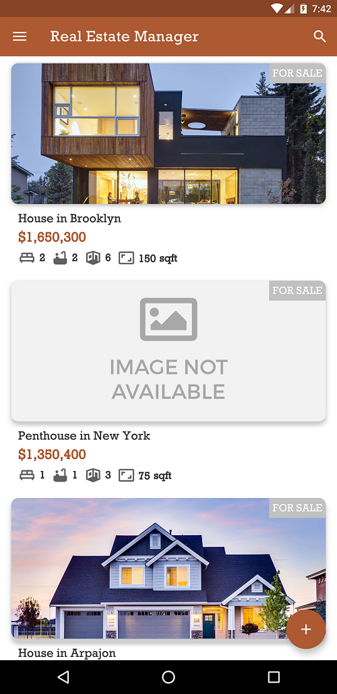
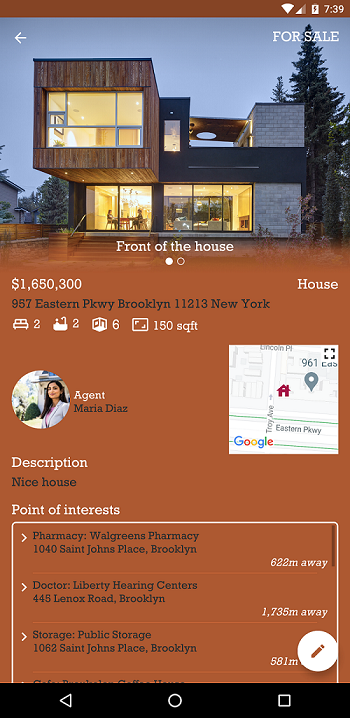
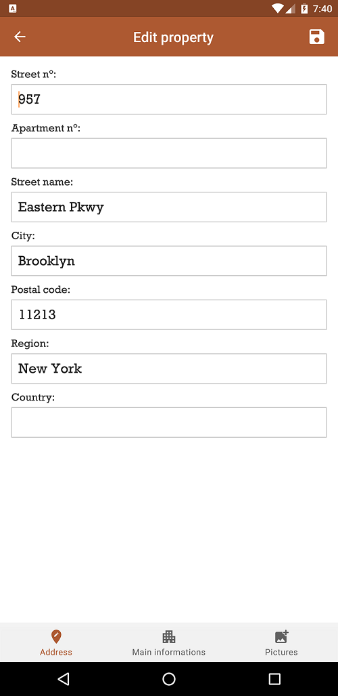
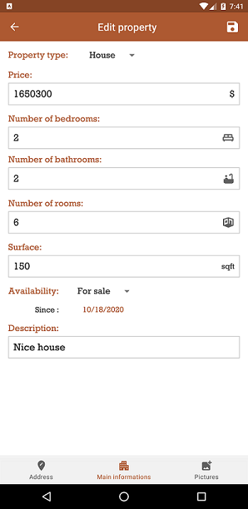
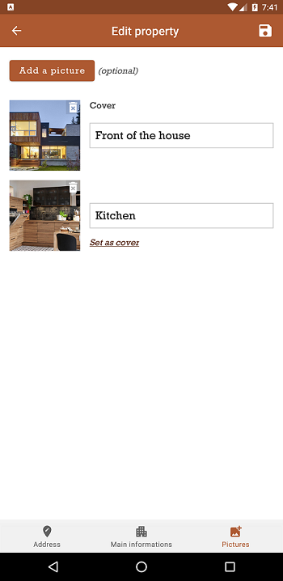
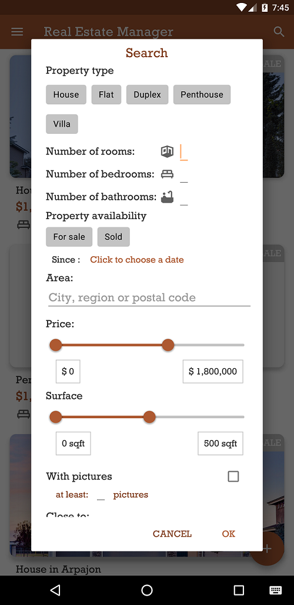
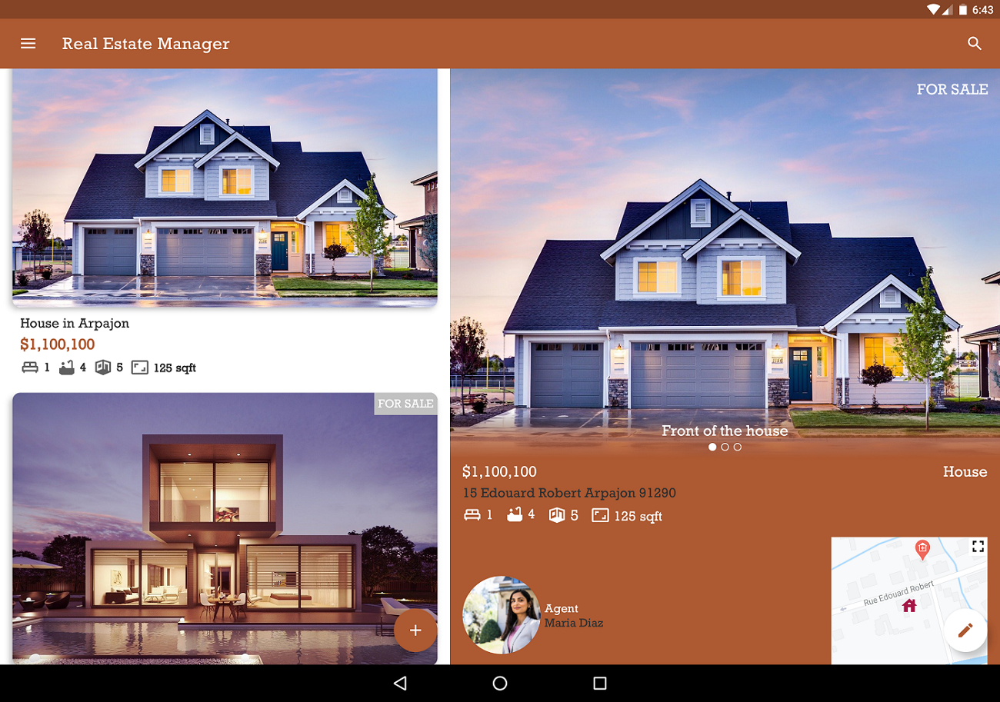

# Projet Real Estate Manager
Création d'une application permettant à des agents immobilier d'une même agence de gérer des biens.

Fonctionnalités:
- Afficher la liste des biens
- Rechercher des biens selon différents critères
- Ajouter/Modifier un bien immobilier
- Afficher le profil d'un bien
- Accéder à une carte qui affiche tous les biens à l'aide de punaises
- Localiser l'agent connecté
- Afficher les biens prit en charge par un agent sur son profil
- Possibilité de changer de photo de profil et de nom d'utilisateur
- Stockage des données sur Firestore et Room (mode hors-ligne)

La résolution du bug qui était dans le projet de départ se trouve dans la branche "bug_fix".

## Screenshots
.  
..

**Affichage tablette:**

## Prerequis
**Obtenir le projet:**
Clicker sur "Clone or Download" en haut à droite du projet sur Github, télécharger et extraire
le fichier zip sur votre ordinateur.

## Installation
Dans Android Studio, ouvrez le projet que vous venez de télécharger
et, si ce n'est pas fait automatiquement, cliquer sur "Sync project with Gradle Files" (menu "File")
puis clicker sur "Build Project" (menu "Build").

**Lancer l'application:** Cliquer sur le bouton "play" ou sélectionnez "Run 'app' " dans le menu "Run".

## Lancement des tests unitaires et UI

Vous trouverez les test unitaires dans le dossier "test" et les tests instrumentalisés
dans le dossier "androidTest".

**Lancer tous les tests d'une même classe:** Click droit sur le nom de la classe
et appuyez sur "Run 'NomDeLaClasse'".

**Lancer les tests un par un:** Click droit sur le nom de la méthode @Test que vous désirez lancer,
et appuyez sur ""Run 'NomDeLaMethode'".

## Librairies

- FirebaseUI
- FirebaseStorage
- Places
- Room
- Koin
- Glide
- Retrofit
- Gson
- Espresso
- AndroidX
- Content Provider
- WorkManager

